# pi-Mesh

A touch-friendly web dashboard for [Meshtastic](https://meshtastic.org/) LoRa mesh radio networks, designed to run on a **Raspberry Pi** with a **320×480 touchscreen**. Monitor and control your mesh network from a pocket-sized device — or from any browser on the same Wi-Fi network.


---

## Screenshots

### Portrait — 320×480 touchscreen

<table>
  <tr>
    <td align="center"><b>Nodi</b><br>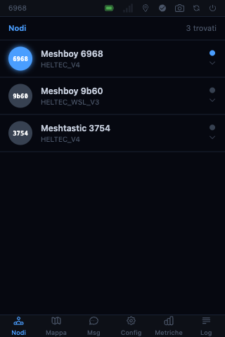</td>
    <td align="center"><b>Nodo espanso</b><br>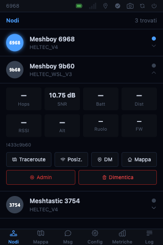</td>
    <td align="center"><b>Messaggi</b><br>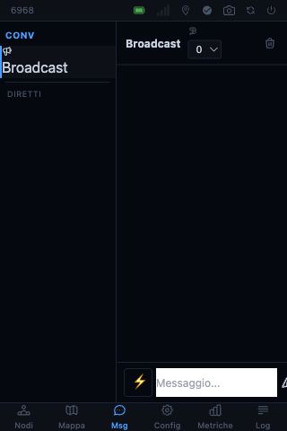</td>
    <td align="center"><b>Mappa</b><br>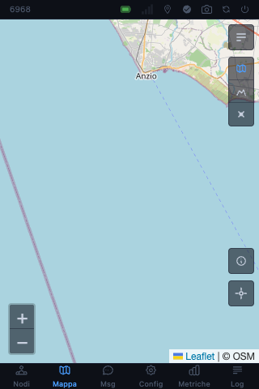</td>
  </tr>
  <tr>
    <td align="center"><b>Filtri mappa</b><br>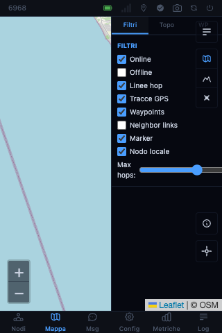</td>
    <td align="center"><b>Config</b><br>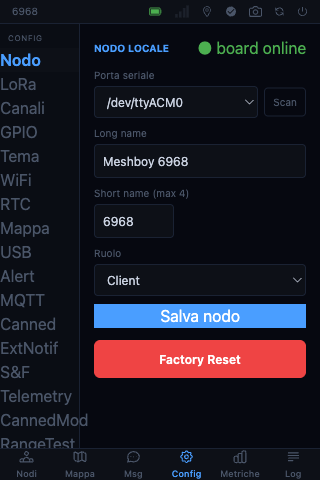</td>
    <td align="center"><b>Metriche</b><br>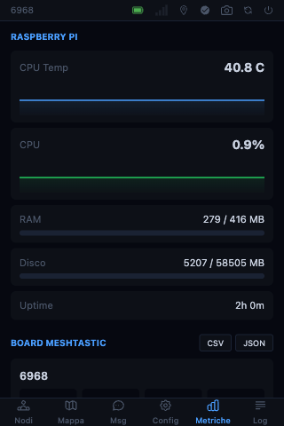</td>
    <td align="center"><b>Log pacchetti</b><br>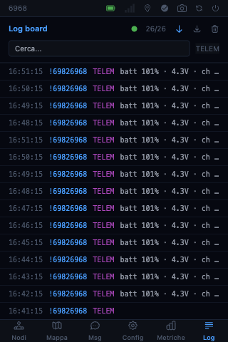</td>
  </tr>
</table>

### Landscape — 480×320

<table>
  <tr>
    <td align="center"><b>Nodi — lista + dettaglio</b><br>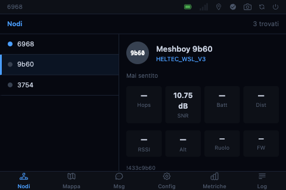</td>
    <td align="center"><b>Azioni nodo remoto</b><br>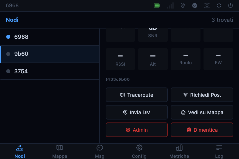</td>
  </tr>
  <tr>
    <td align="center"><b>Mappa</b><br>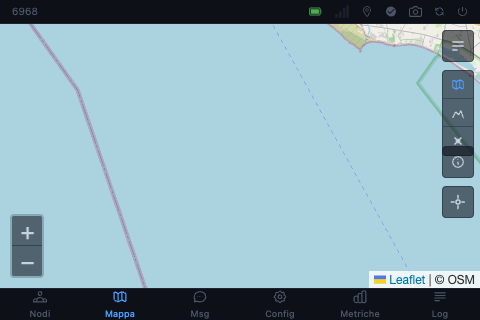</td>
    <td align="center"><b>Mappa — filtri e layer</b><br>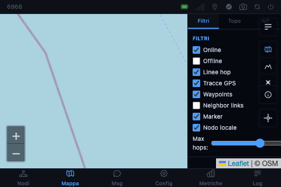</td>
  </tr>
  <tr>
    <td align="center"><b>Config</b><br>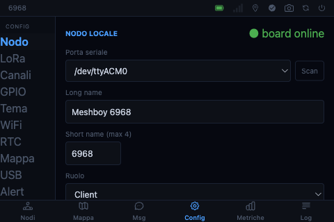</td>
    <td align="center"><b>Messaggi</b><br>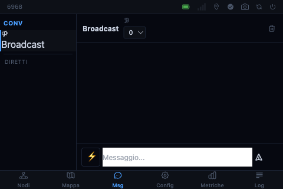</td>
  </tr>
  <tr>
    <td align="center"><b>Metriche Pi + board</b><br>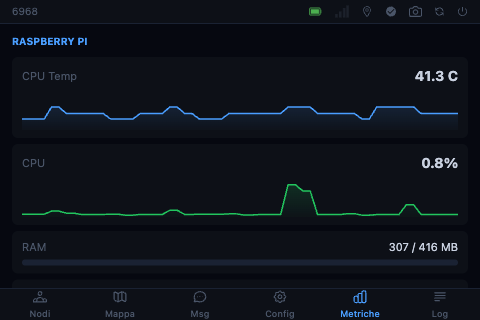</td>
    <td align="center"><b>Log pacchetti live</b><br>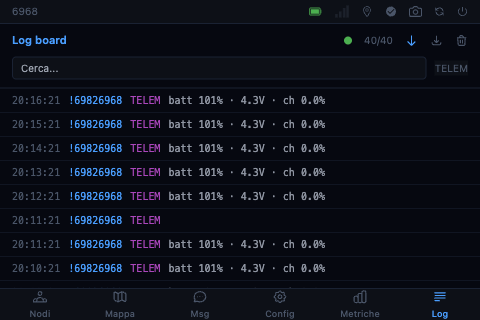</td>
  </tr>
</table>

---

## Features

### Nodes
- Real-time list of all mesh nodes — online/offline status, SNR, battery, distance, last-heard
- Portrait: tap to expand inline (stats + action buttons)
- Landscape: two-column layout — node list left, full detail panel right
- Per-node actions: **Traceroute**, **Request position**, **Direct message**, **Focus on map**, **Remote admin**, **Forget node**

### Messaging
- Broadcast channel + direct messages (DM) to individual nodes
- ⚡ **Canned messages** — configurable quick-send presets, one tap to send
- WebSocket real-time delivery — messages appear instantly without refresh

### Map
- [Leaflet.js](https://leafletjs.com/) with OSM, topographic, and satellite layers
- Node markers with popup (name, SNR, battery, last-heard, action buttons)
- **Waypoints** — receive and display Meshtastic waypoints as map markers
- **Neighbor links** — visualize mesh topology as lines between nodes
- **Traceroute lines** — animated hop-by-hop path overlay
- Custom POI markers (add/delete your own)
- Filter panel with 3 tabs: Filters · Topology graph · Waypoints list
- Offline tile support (local PNG tile cache)

### Configuration
- **Node** — long name, short name, serial port, role, factory reset
- **LoRa** — region, modem preset, frequency, bandwidth, spread factor, transmit power
- **Channels** — view and configure all 8 mesh channels
- **GPIO / WiFi / Bluetooth / RTC / NTP / USB** — peripheral settings
- **Alert** — external notification module config
- **MQTT** — broker, topic, TLS, proxy settings
- **Module configs** — Extended Notifications, Store & Forward, Telemetry, Canned Messages (module), Range Test, Detection Sensor, Ambient Light, Neighbor Info, Serial
- **Canned messages** — manage the quick-send preset list
- **Map** — default coordinates, zoom

### Remote Admin
- **Request position / telemetry** from remote nodes over the mesh
- **Reboot** remote node
- **Factory reset** with double-confirm (type "RESET") — destructive action protected

### Metrics
- Raspberry Pi system: CPU temperature, CPU load, RAM, disk usage, uptime
- Board telemetry: battery, voltage, channel utilization, air utilization
- 60-second live graphs via SSE polling

### Log
- Live packet log — all received radio packets with type, SNR, hop limit
- Filter by port number, search by node ID
- Download as JSON or clear log
- Board connection indicator (online / n packets buffered)

---

## Hardware

| Component | Details |
|-----------|---------|
| Raspberry Pi 3 A+ or newer | 512 MB RAM minimum |
| Meshtastic radio | Connected via USB — Heltec V3/V4, T-Beam, RAK, etc. |
| 3.5" 320×480 touchscreen | Portrait and landscape layouts both supported |

> Pi-Mesh talks directly to the radio via `meshtastic.SerialInterface`. The `meshtasticd` daemon is **not required** for ESP32-based boards.

---

## Installation

### 1 — Clone and set up the environment

```bash
cd ~
git clone https://github.com/yayoboy/pi-Mesh.git
cd pi-Mesh
python3 -m venv venv
source venv/bin/activate
pip install -r requirements.txt
```

### 2 — Configure

```bash
cp config.env.example config.env.local
nano config.env.local
```

Key settings:

```env
# USB serial port of the Meshtastic radio
SERIAL_PATH=/dev/ttyACM0

# SQLite database path
DB_PATH=/home/pimesh/pi-Mesh/data/mesh.db

# Map bounding box — set to your area
MAP_LAT_MIN=41.0
MAP_LAT_MAX=43.0
MAP_LON_MIN=11.5
MAP_LON_MAX=14.5
```

Finding the radio's serial port:

```bash
ls /dev/ttyUSB* /dev/ttyACM*
# Heltec V3/V4 / ESP32 → typically /dev/ttyACM0
```

### 3 — Run (test)

```bash
source venv/bin/activate
uvicorn main:app --host 0.0.0.0 --port 8080 --env-file config.env.local
```

Open `http://<pi-ip>:8080` in a browser or on the touchscreen.

### 4 — Install as a system service

```bash
sudo cp pimesh.service /etc/systemd/system/
sudo systemctl daemon-reload
sudo systemctl enable --now pimesh
```

Check status:

```bash
sudo systemctl status pimesh
journalctl -u pimesh -f
```

### 5 — Offline map tiles (optional)

The map defaults to CDN tiles (OSM + Esri). For offline use, place tiles at:

```
static/tiles/osm/{z}/{x}/{y}.png
static/tiles/topo/{z}/{x}/{y}.png
static/tiles/satellite/{z}/{x}/{y}.png
```

Then add `data-local-tiles="1"` to the `<html>` tag in `templates/base.html`.

---

## Project Structure

```
pi-Mesh/
├── main.py                      # FastAPI app — lifespan, router registration, broadcast task
├── meshtasticd_client.py        # Serial interface, event queue, command queue, node cache
├── database.py                  # SQLite via aiosqlite — all tables and CRUD functions
├── config.py                    # Configuration from environment / config.env
│
├── routers/
│   ├── nodes.py                 # GET /api/nodes, /nodes page
│   ├── commands.py              # Traceroute, request-position, DM
│   ├── messages_router.py       # Message history, send
│   ├── canned_router.py         # Canned messages CRUD
│   ├── map_router.py            # Map page, custom markers, waypoints
│   ├── waypoints_router.py      # /api/waypoints — list, delete, send
│   ├── neighbor_router.py       # /api/neighbor-info
│   ├── config_router.py         # Node / LoRa / channel config read+write
│   ├── module_config_router.py  # 9 module configs (ExtNotif, S&F, Telemetry, …)
│   ├── admin_router.py          # Remote admin — position, telemetry, reboot, factory reset
│   ├── metrics_router.py        # Pi system + board telemetry metrics
│   ├── log_router.py            # Live packet log (SSE)
│   └── ws_router.py             # WebSocket /ws — ConnectionManager + broadcast
│
├── templates/
│   ├── base.html                # Shell: status bar, tab bar, Alpine.js globals
│   ├── nodes.html               # Node list — portrait expand-row / landscape 2-column
│   ├── messages.html            # Channel + DM messaging with canned presets
│   ├── map.html                 # Leaflet map — markers, filters, topology, waypoints
│   ├── config.html              # Full device configuration (20+ sections)
│   ├── metrics.html             # System + board metrics with live graphs
│   └── log.html                 # Live packet log with search/filter/export
│
├── static/
│   ├── app.js                   # WebSocket client, SPA navigation, nodeActions
│   ├── map.js                   # Leaflet init, all layer groups, WS event handlers
│   └── tiles/                   # Optional offline map tiles
│
└── tests/                       # pytest — hardware-free mocks for all core functionality
    ├── test_canned_db.py
    ├── test_new_packets_db.py
    └── …
```

---

## API Reference

### Nodes

| Method | Path | Description |
|--------|------|-------------|
| `GET` | `/api/nodes` | All known nodes |
| `GET` | `/api/nodes/{id}` | Single node |
| `POST` | `/api/nodes/{id}/traceroute` | Send traceroute |
| `GET`  | `/api/nodes/{id}/traceroute` | Get cached traceroute result |
| `POST` | `/api/nodes/{id}/request-position` | Request GPS update |
| `DELETE` | `/api/nodes/{id}` | Forget node |

### Messaging

| Method | Path | Description |
|--------|------|-------------|
| `GET`  | `/api/messages` | Message history |
| `POST` | `/api/messages/send` | Send message `{"to": "!abc", "text": "hi", "channel": 0}` |
| `GET`  | `/api/canned-messages` | List canned message presets |
| `POST` | `/api/canned-messages` | Create preset `{"text": "CQ CQ", "sort_order": 0}` |
| `PUT`  | `/api/canned-messages/{id}` | Update preset |
| `DELETE` | `/api/canned-messages/{id}` | Delete preset |

### Map & Waypoints

| Method | Path | Description |
|--------|------|-------------|
| `GET`  | `/api/map/markers` | Custom POI markers |
| `POST` | `/api/map/markers` | Create marker |
| `DELETE` | `/api/map/markers/{id}` | Delete marker |
| `GET`  | `/api/waypoints` | Received Meshtastic waypoints |
| `POST` | `/api/waypoints/send` | Broadcast a waypoint over the mesh |
| `DELETE` | `/api/waypoints/{id}` | Delete waypoint |
| `GET`  | `/api/neighbor-info` | Neighbor topology data |

### Configuration

| Method | Path | Description |
|--------|------|-------------|
| `GET`  | `/api/config/node` | Read node config |
| `POST` | `/api/config/node` | Write node config |
| `GET`  | `/api/config/lora` | Read LoRa config |
| `POST` | `/api/config/lora` | Write LoRa config |
| `GET`  | `/api/config/module/{name}` | Read module config (ext_notif, store_forward, telemetry, canned_message, range_test, detection_sensor, ambient_light, neighbor_info, serial) |
| `POST` | `/api/config/module/{name}` | Write module config |

### Remote Admin

| Method | Path | Description |
|--------|------|-------------|
| `POST` | `/api/admin/{node_id}/request-position` | Request position from remote node |
| `POST` | `/api/admin/{node_id}/request-telemetry` | Request telemetry from remote node |
| `POST` | `/api/admin/{node_id}/reboot` | Reboot remote node |
| `POST` | `/api/admin/{node_id}/factory-reset` | Factory reset remote node |

All command endpoints return `503` if the board is not connected.

### WebSocket

`WS /ws` — real-time events broadcast to all connected clients.

```json
{ "type": "init",              "nodes": [...] }
{ "type": "node",              "id": "!abc", "short_name": "NODE", "snr": -8 }
{ "type": "position",          "id": "!abc", "latitude": 41.9, "longitude": 12.5 }
{ "type": "telemetry",         "id": "!abc", "battery_level": 85, "voltage": 4.1 }
{ "type": "traceroute_result", "node_id": "!abc", "hops": ["!111", "!222"] }
{ "type": "message",           "from": "!abc", "text": "hello", "channel": 0 }
{ "type": "waypoint",          "id": 1, "name": "Base", "latitude": 41.9, "longitude": 12.5 }
{ "type": "neighbor_info",     "node_id": "!abc", "neighbors": [{"node_id": "!def", "snr": -5}] }
{ "type": "log",               "ts": 1711700000, "from": "!abc", "portnum": "TELEMETRY_APP", "snr": -8 }
```

---

## Architecture Notes

- **Dual queue pattern**: `_event_queue` (board → UI, `call_soon_threadsafe`) and `_command_queue` (UI → board, `run_in_executor`) keep the async event loop and the serial thread fully decoupled
- **Write-batching**: node cache flushes to SQLite every 60 s (preserves SD card write cycles), also on shutdown
- **DB boot preload**: node cache is populated from SQLite before the board connects — the UI shows last-known state immediately on startup
- **Alpine.js `x-teleport`**: modals use `<template x-teleport="body">` to escape `overflow:hidden` flex containers, critical on the 320×480 display
- **SPA navigation**: tab switching replaces `<main>` `innerHTML` — external JS (Leaflet, Alpine) is re-initialized per-page to avoid stale state
- **Responsive layout**: `@media (orientation: portrait/landscape)` — portrait shows expand-row, landscape shows 2-column list+detail panel

---

## Development

### Run tests

```bash
python3 -m venv venv && source venv/bin/activate
pip install -r requirements.txt
pytest tests/ -v
```

All tests run without hardware — serial, Meshtastic, and DB are mocked.

### Deploy to Pi

```bash
sshpass -p pimesh rsync -avz \
  main.py database.py meshtasticd_client.py config.py \
  routers/ templates/ static/ \
  pimesh@192.168.1.36:~/pi-Mesh/

sshpass -p pimesh ssh pimesh@192.168.1.36 "sudo systemctl restart pimesh"
```

---

## License

MIT — see [LICENSE](LICENSE) for details.
